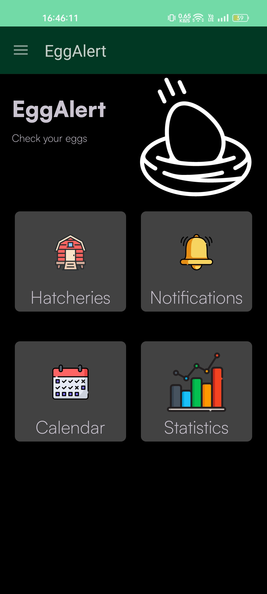
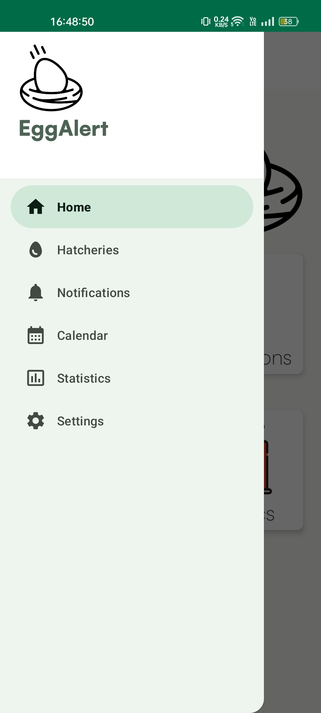
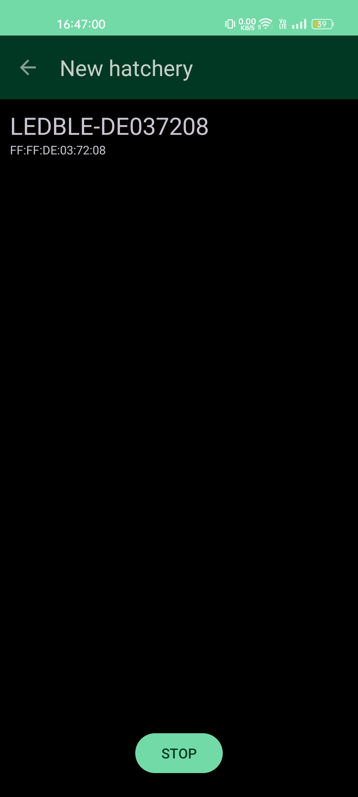
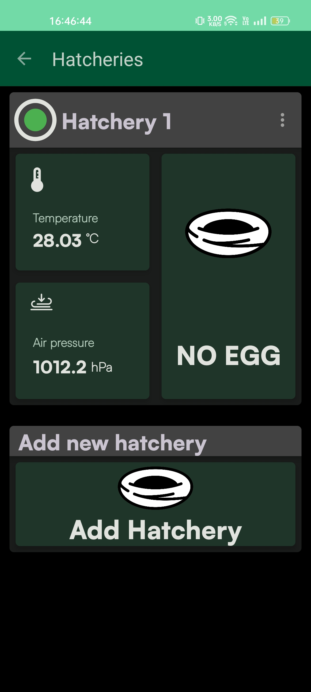
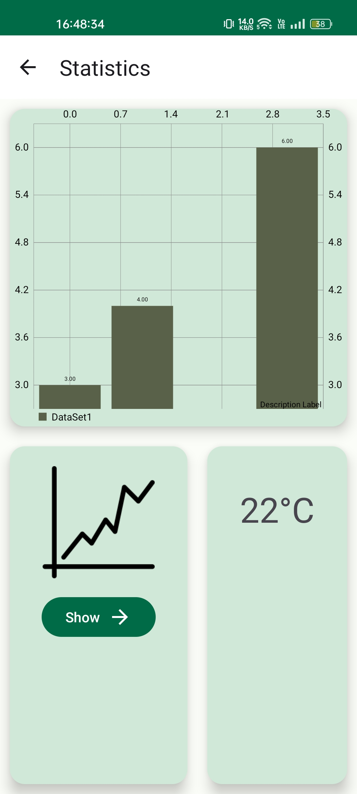

# Egg Alert App
An AI-powered egg detection for hen houses. Swiftly identify fresh eggs with precision: streamline chicken coop operations effortlessly.
## Seamless Connectivity: Pairing the Hardware with the Egg Alert Smart Phone App using Bluetooth Low Energy

  

The workflow of the Egg Alert app's Bluetooth connection is as follows:

1. Launch the Egg Alert app on your Android device and ensure that Bluetooth is enabled.

  

2. To register a hatchery, click on the Hatcheries tab and select Add Hatchery.

  

3. The app scans for available Bluetooth devices in the vicinity. It specifically looks for devices that advertise with the correct local name, indicating an Egg Alert device.

4. If the app finds a device, establish a connection with it.

  

5. The app starts monitoring the Egg Alert device for any new egg detections.

6. Whenever a new egg is detected by the Egg Alert device, it sends a notification to the app via Bluetooth.

7. The app receives the notification and promptly alerts the user about the newly laid egg.

8. The app keeps a record of the egg detections, allowing the user to review the history of laid eggs.

## Harnessing Statistical Analysis for Optimal Chicken Coop Management with the Egg Alert App

The Egg Alert app revolutionizes the way users monitor and manage their chicken coops by offering real-time notifications and comprehensive statistical analysis. With a focus on empowering users with valuable insights, the app provides detailed information about when and where the eggs were laid and the quantity of eggs laid. Through its intuitive interface, users can easily access statistical data that highlights patterns, trends, and fluctuations in egg production.

This comprehensive analysis enables users to make data-driven decisions in optimizing their chicken coop operations. They can identify peak laying periods, evaluate the impact of environmental factors, and adjust feed schedules or lighting conditions accordingly. Additionally, the app allows users to track and compare egg production data over different time periods, enabling them to assess long-term performance and make informed projections.

  

## Getting Started

To start using EggAlert, follow these steps:

   1. Clone the EggAlert repository to your local machine using the following command:
      
    git clone git@github.com:Matjazg/EggAlert_app.git
   2. Install the necessary dependencies, including the required programming language (e.g., Python) and any additional libraries or packages.

   3. Open the project in your preferred development environment (e.g., PyCharm, Visual Studio Code).

   4. Configure the project settings, such as API keys or database connections, as specified in the project documentation.

   5. Run the application on your local machine to start monitoring egg detection and managing your chicken coop.

Feel free to explore the project structure, review the source code, and refer to the documentation for further information. Contributions are welcome, whether it's fixing issues, adding new features, or improving existing functionalities.

We hope EggAlert simplifies your chicken coop management and provides valuable insights into egg production. Happy monitoring and farming!

